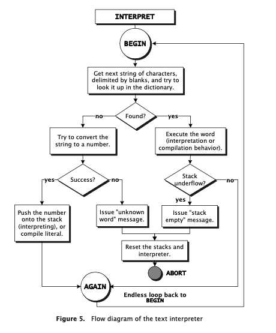

Forth Interpreter (build using the Rust programming Language)
================

Introduction
------------

Early implementation of a Forth interpreter (stack based programming language) using the Rust programming Language.

In this stage it only acts as a simple postfix calculator, with the 4 basic operations.

from: forth-programmers-handbook

Getting Started
---------------

### Prerequisites

List any prerequisites required to run your project. For example:

*   Rust programming language
*   Cargo (Rust's package manager)

### Installation

shellCopy code

`git clone https://github.com/mvcorrea-ufc/rust-forth.git cd rust-forth cargo build`

Usage
-----

Explain how to use your interpreter. Include any commands or scripts needed to run it. For example:

shellCopy code

`cargo run`

### Running Commands from a File

Describe how to run commands from a file. For example:

shellCopy code

`cargo run -- commands.txt`

Replace `commands.txt` with the path to your file containing the interpreter commands.

example: 
`5 10 + 2 * 31 32 33 + + +` .  (returns: Stack { data: [126] })

Features
--------

*   Stack-based operations
*   Basic arithmetic functions
*   File input processing

Contributing
------------

So far, just a lone runner :)

License
-------

Not applicable.

Authors
-------

*   Marcelo Correa - Initial work - mvcorrea-ufc

Acknowledgments
---------------

None so far